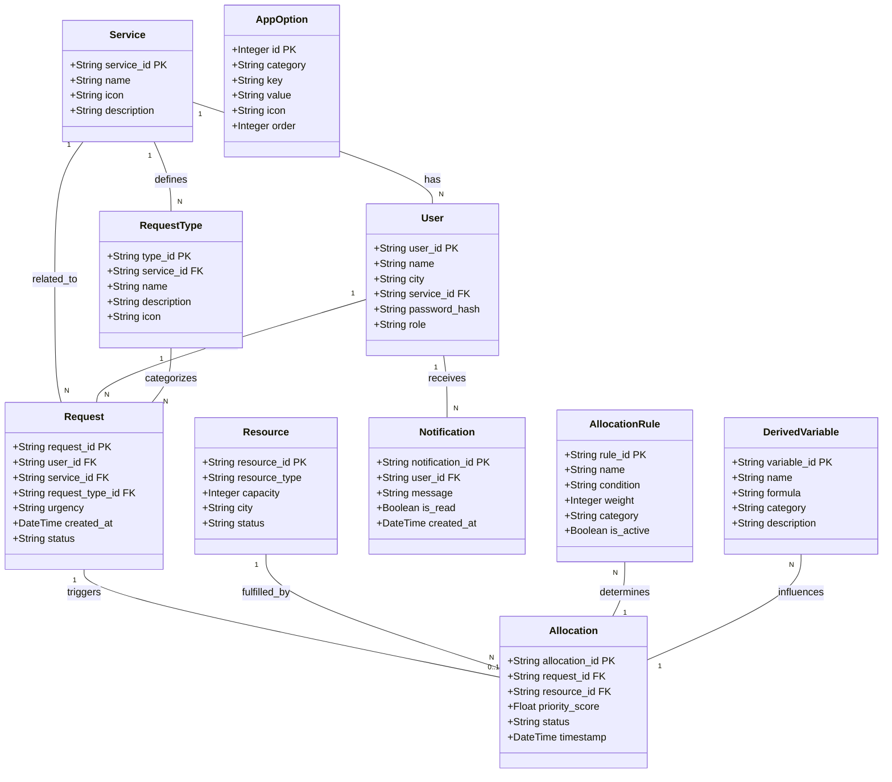

# Kaynak Tahsis Sistemi

**Code Night - Teknocanlar Takımı Case 2 Çözümü**

Bu proje, Turkcell servislerine gelen talepleri dinamik kural motoru ile önceliklendiren ve kaynak tahsisi yapan bir sistemdir.

## İçindekiler

- [Genel Bakış](#genel-bakış)
- [Veritabanı Şeması](#veritabanı-şeması)
- [Özellikler](#özellikler)
- [Mimari](#mimari)
  - [Dinamik Kural Motoru](#dinamik-kural-motoru)
- [Kurulum](#kurulum)
- [Kullanım](#kullanım)
- [API Dokümantasyonu](#api-dokümantasyonu)
- [Takım](#takım)

---

## Genel Bakış

Sistem, müşteri taleplerine göre teknik kaynakların otomatik tahsisini gerçekleştirir. Dinamik kural motoru sayesinde iş kuralları kod değişikliği olmadan veritabanı üzerinden yönetilebilir.

**Ana Özellikler:**

- Dinamik önceliklendirme sistemi
- Matematiksel değişkenler ve mantıksal kurallar
- Gerçek zamanlı kaynak tahsisi
- Bildirim sistemi entegrasyonu
- Çoklu servis desteği (Superonline, TV+, vb.)

---

## Veritabanı Şeması

Sistem aşağıdaki varlık ilişki modelini kullanır:



### Ana Tablolar

**Service** - Sistem üzerindeki servisler (Superonline, TV+, vb.)

**User** - Sistem kullanıcıları ve müşteriler

**Request** - Gelen hizmet talepleri

**Resource** - Tahsis edilebilir kaynaklar (teknisyen, ekipman, vb.)

**Allocation** - Talep-kaynak eşleşmeleri ve öncelik puanları

**AllocationRule** - Dinamik iş kuralları

**DerivedVariable** - Hesaplanmış metrikler için formüller

**Notification** - Kullanıcı bildirimleri

---

## Dinamik Kural Motoru

### Genel Bakış

Sistem, hesapsal mantığı koşulsal mantıktan ayıran **deklaratif bir kural motoru** kullanır. Her ikisi de veritabanında ifade olarak saklanır, bu sayede kod dağıtımı olmadan çalışma zamanında değiştirilebilir.

**Temel Prensip:** Hesapsal ifadeler (değişkenler) yeni metrikler türetir, koşulsal ifadeler (kurallar) ise bu metriklere göre puanlama yapar.

### Mimari

```
Talep → Bağlam Oluşturma → Değişken Değerlendirme → Kural Değerlendirme → Öncelik Puanı
```

#### İki Bileşenli Sistem

| Bileşen | Tip | Amaç | Sonuç |
|---------|-----|------|-------|
| **Türetilmiş Değişkenler** | Hesapsal | Talep verisinden yeni metrikler hesapla | Sayısal değer |
| **Tahsis Kuralları** | Koşulsal | Boolean karar ver | True/False → Ağırlık |

### Türetilmiş Değişkenler

Yeni metrikler hesaplayan matematiksel ifadeler:

**Desteklenen Operatörler:** `+`, `-`, `*`, `/`, `**`, `%`, `()`

**Örnek:**

```python
# Değişken Tanımı
{
    "name": "risk_skoru",
    "formula": "(aciliyet_skoru * 3) + (bekleme_saati * 2)",
    "description": "Aciliyet ve bekleme süresine göre risk hesaplar"
}

# Çalıştırma
context = {"aciliyet_skoru": 10, "bekleme_saati": 8}
sonuc = eval(formula, context)  # sonuc = 46
```

**Mevcut Değişkenler:**

- `risk_skoru` - Aciliyet ve bekleme süresi bazlı risk
- `servis_onceligi` - Servis tipi önem derecesi
- `musteri_degeri` - Müşteri sadakati ve ödeme değeri
- `teknik_karmasiklik` - Sorun karmaşıklık seviyesi

### Tahsis Kuralları

Koşullar sağlandığında ağırlık ekleyen boolean ifadeler:

**Mantıksal Operatörler:** `==`, `!=`, `>`, `<`, `>=`, `<=`, `and`, `or`, `not`, `in`

**Örnek:**

```python
# Kural Tanımı
{
    "rule_id": "RULE-001",
    "condition": "urgency == 'HIGH' and risk_skoru > 40",
    "weight": 50,
    "is_active": True
}

# Çalıştırma
if eval(condition, context):  # Eğer True ise
    oncelik_puani += weight  # 50 puan ekle
```

**Varsayılan Kurallar:**

- `RULE-001` - Yüksek aciliyet önceliği (+50)
- `RULE-002` - Orta aciliyet önceliği (+25)
- `RULE-003` - Düşük aciliyet önceliği (+10)
- `RULE-004` - Superonline servis bonusu (+20)
- `RULE-005` - Uzun bekleme süresi bonusu (+15)
- `RULE-006` - Ağ kesintisi kritik (+40)
- `RULE-007` - VIP müşteri önceliği (+45)
- `RULE-008` - Kritik kombinasyon (+60)

### Çalışma Akışı

**Faz 1: Bağlam Oluşturma**

```python
context = {
    "urgency": "HIGH",
    "service": "Superonline",
    "waiting_hours": 8,
    "urgency_score": 10  # Aciliyet seviyesinden eşlendi
}
```

**Faz 2: Değişken Değerlendirme**

```python
# Tüm DerivedVariable formüllerini çalıştır
for variable in variables:
    context[variable.name] = eval(variable.formula, context)

# Context artık şunları içerir:
# - risk_skoru = 46
# - servis_onceligi = 10
```

**Faz 3: Kural Değerlendirme**

```python
toplam_puan = 0
for rule in aktif_kurallar:
    if eval(rule.condition, context):
        toplam_puan += rule.weight

# Nihai puan: 85
```

### Tam Örnek

**Giriş Talebi:**

```json
{
    "urgency": "HIGH",
    "service": "Superonline",
    "waiting_hours": 8
}
```

**Hesaplama Adımları:**

| Adım | Tip | İfade | Sonuç |
|------|-----|-------|-------|
| Giriş | - | urgency='HIGH', service='Superonline', waiting_hours=8 | - |
| Değişken | `risk_skoru` | `(10 * 3) + (8 * 2)` | 46 |
| Değişken | `servis_onceligi` | `10 if service=='Superonline' else 5` | 10 |
| Kural | `urgency == 'HIGH'` | True | +50 |
| Kural | `service == 'Superonline'` | True | +20 |
| Kural | `waiting_hours > 4` | True | +15 |
| Kural | `risk_skoru > 50` | False | +0 |
| **Toplam** | - | - | **85** |

### Avantajlar

- **Çalışma Zamanı Konfigürasyonu** - Kod dağıtımı olmadan kuralları değiştir
- **Versiyon Kontrolü** - Tüm değişiklikler veritabanında takip edilir
- **A/B Testleri** - Deney için kuralları aktif/pasif yap
- **Azaltılmış Teknik Borç** - İş mantığı koddan dışsallaştırıldı
- **Ölçeklenebilirlik** - Çekirdek motoru değiştirmeden yeni kurallar ekle

### API Endpointleri

#### Tüm Kuralları Getir

```bash
GET /api/rules
```

#### Yeni Kural Oluştur

```bash
POST /api/rules
Content-Type: application/json

{
    "rule_id": "RULE-021",
    "name": "Hafta Sonu Önceliği",
    "condition": "is_weekend == True and urgency == 'HIGH'",
    "weight": 25,
    "category": "TEMPORAL",
    "is_active": true
}
```

#### Kural Durumunu Değiştir

```bash
PATCH /api/rules/RULE-001/toggle
```

#### Türetilmiş Değişken Oluştur

```bash
POST /api/variables
Content-Type: application/json

{
    "variable_id": "VAR-006",
    "name": "musteri_yasam_boyu_degeri",
    "formula": "(tenure_years * 100) + (monthly_payment * 12)",
    "category": "CUSTOMER"
}
```

### Güvenlik Konuları

- `eval()` kısıtlı globaller ile çalıştırılır: `{"__builtins__": None}`
- Dynamicquery yapısı sayesinde matematiksel ve mantıksal işlemlere izin verilir
- Dosya sistemi veya ağ erişimi mümkün değildir
- Tüm ifadelerde girdi doğrulaması yapılır
- Başarısız değerlendirmeler loglanır ancak pipeline'ı kırmaz

### Performans

- Kurallar uygulama seviyesinde önbelleklenir
- Kural başına milisaniyenin altında değerlendirme
- Saniyede 100+ talep işler
- Veritabanı sorguları önbellekleme ile minimize edilir

---
